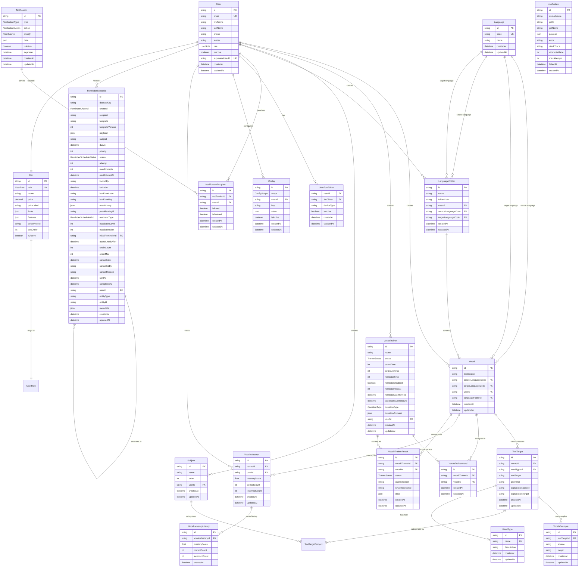
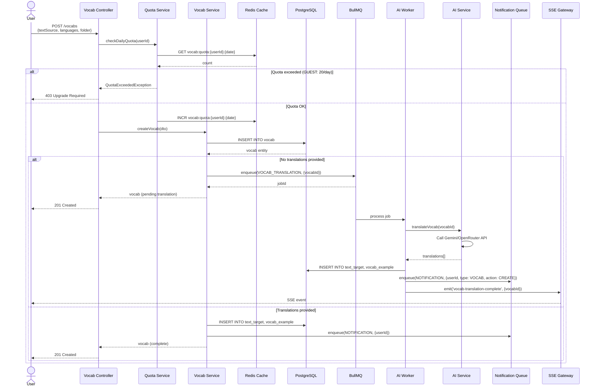
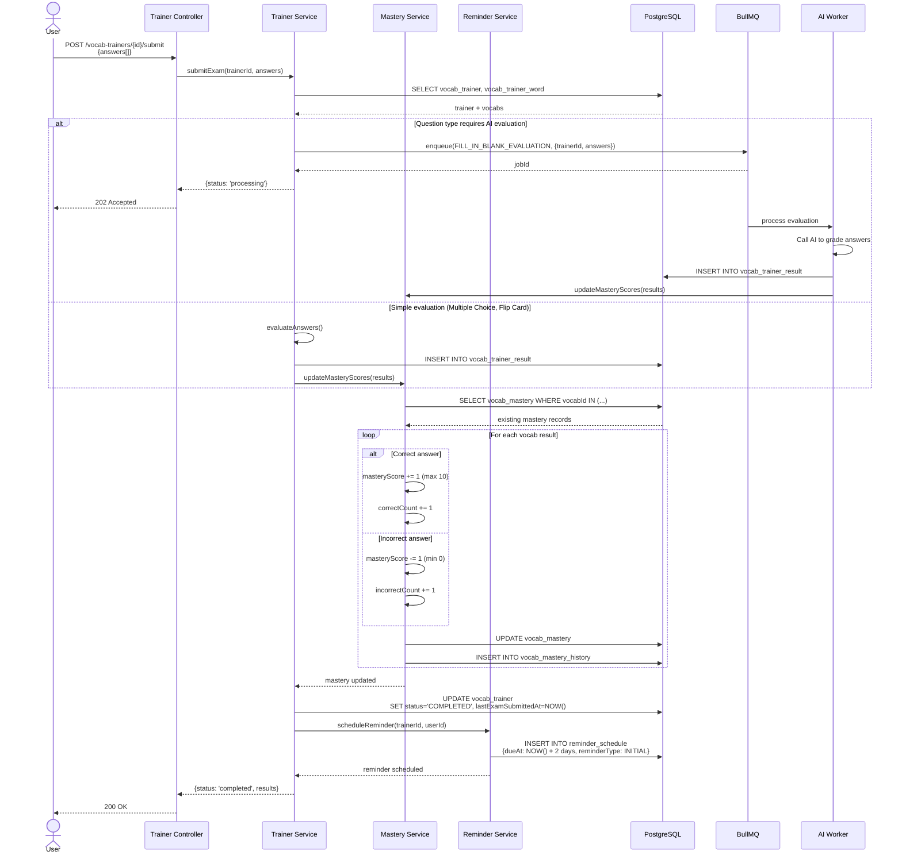
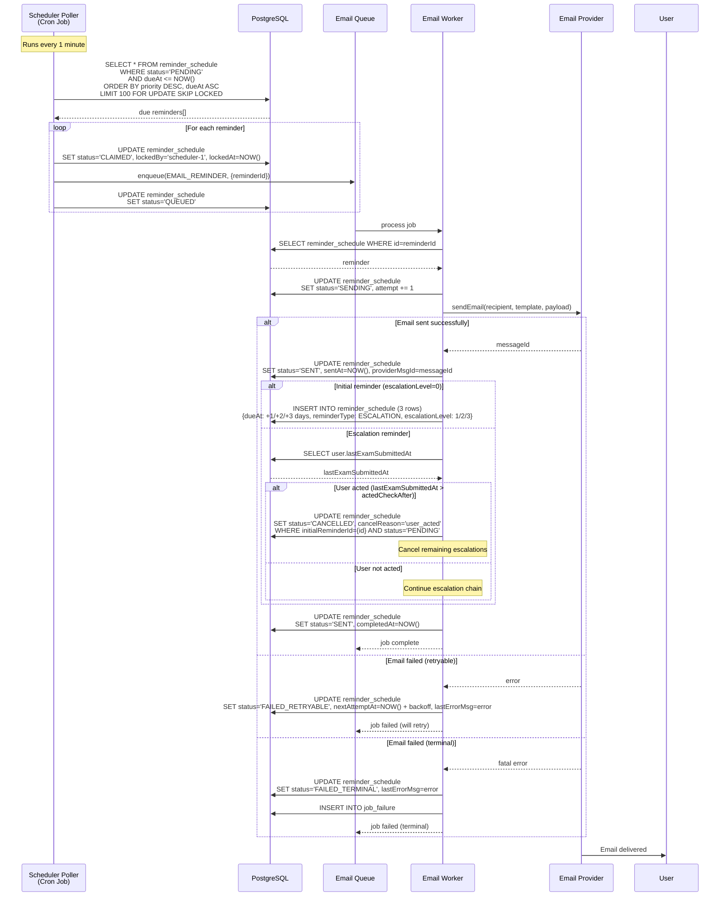
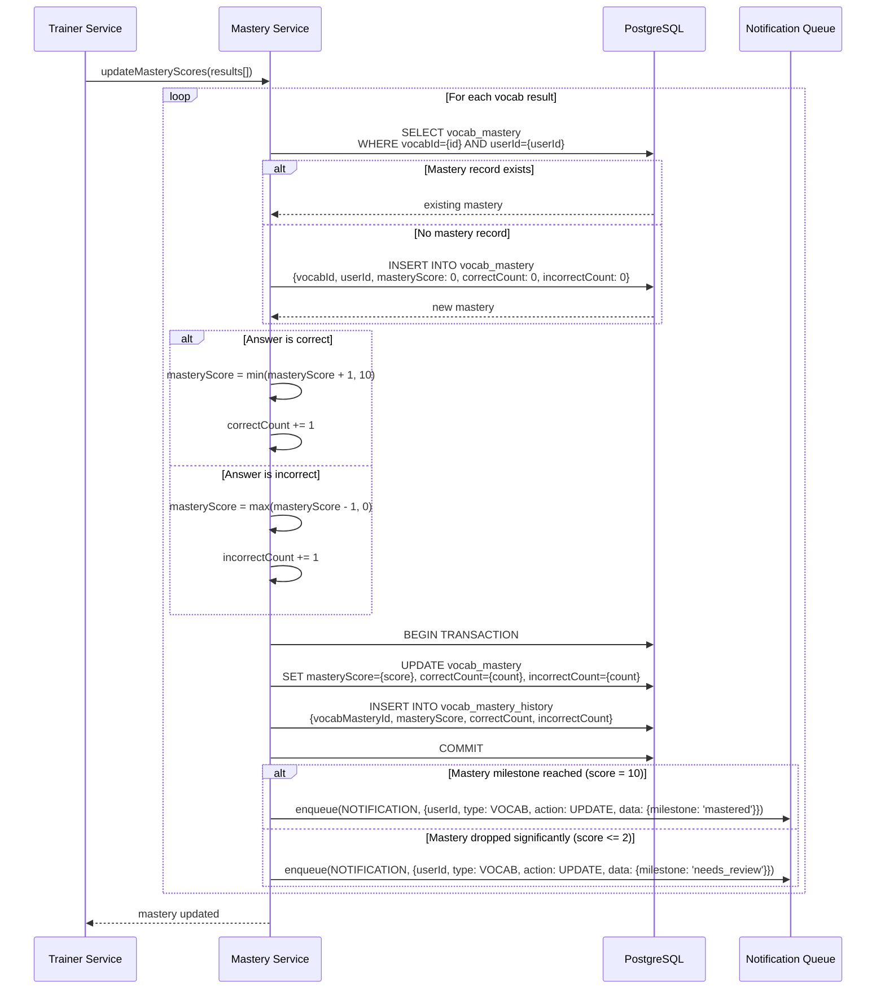

## 1. High-level System Architecture Diagram

```mermaid
graph TB
    subgraph "Client Layer"
        WEB[Web Client]
        MOBILE[Mobile App]
    end

    subgraph "API Gateway Layer"
        API[REST API<br/>/api/v1]
        WS[WebSocket<br/>Socket.IO]
        SSE[Server-Sent Events<br/>/sse/events]
    end

    subgraph "NestJS Application - Modular Monolith"
        subgraph "Presentation Layer"
            CTRL_AUTH[Auth Controllers]
            CTRL_VOCAB[Vocab Controllers]
            CTRL_TRAINER[Trainer Controllers]
            CTRL_NOTIF[Notification Controllers]
            CTRL_ADMIN[Admin Controllers]
        end

        subgraph "Business Logic Layer"
            SVC_AUTH[Auth Services]
            SVC_VOCAB[Vocab Services]
            SVC_TRAINER[Trainer Services]
            SVC_AI[AI Services]
            SVC_NOTIF[Notification Services]
            SVC_REMINDER[Reminder Services]
            SVC_MASTERY[Mastery Services]
        end

        subgraph "Data Access Layer"
            REPO[Prisma Repositories]
            CACHE[Redis Cache]
        end

        subgraph "Background Jobs"
            QUEUE_EMAIL[Email Queue]
            QUEUE_AI[AI Processing Queue]
            QUEUE_NOTIF[Notification Queue]
            QUEUE_FCM[FCM Queue]
            SCHEDULER[Reminder Scheduler]
            DLQ[Dead Letter Queue]
        end
    end

    subgraph "External Services"
        SUPABASE[Supabase<br/>Auth + Storage]
        FIREBASE[Firebase FCM<br/>Push Notifications]
        AI_GEMINI[Google Gemini AI]
        AI_OPENROUTER[OpenRouter AI]
        AI_GROQ[Groq AI]
        CLOUDINARY[Cloudinary<br/>Image Storage]
        SMTP[Email SMTP]
    end

    subgraph "Infrastructure"
        POSTGRES[(PostgreSQL<br/>Primary Database)]
        REDIS[(Redis<br/>Cache + Queues)]
        BULL[BullMQ<br/>Job Processor]
    end

    subgraph "Monitoring"
        BULLBOARD[Bull Board<br/>Queue Dashboard]
        SWAGGER[Swagger UI<br/>API Docs]
    end

    %% Client connections
    WEB --> API
    WEB --> WS
    WEB --> SSE
    MOBILE --> API
    MOBILE --> WS

    %% API to Controllers
    API --> CTRL_AUTH
    API --> CTRL_VOCAB
    API --> CTRL_TRAINER
    API --> CTRL_NOTIF
    API --> CTRL_ADMIN
    WS --> CTRL_NOTIF
    SSE --> CTRL_NOTIF

    %% Controllers to Services
    CTRL_AUTH --> SVC_AUTH
    CTRL_VOCAB --> SVC_VOCAB
    CTRL_TRAINER --> SVC_TRAINER
    CTRL_NOTIF --> SVC_NOTIF
    CTRL_ADMIN --> BULLBOARD

    %% Service interactions
    SVC_VOCAB --> SVC_AI
    SVC_VOCAB --> SVC_NOTIF
    SVC_TRAINER --> SVC_AI
    SVC_TRAINER --> SVC_MASTERY
    SVC_TRAINER --> SVC_REMINDER
    SVC_REMINDER --> SCHEDULER

    %% Services to Data Layer
    SVC_AUTH --> REPO
    SVC_VOCAB --> REPO
    SVC_TRAINER --> REPO
    SVC_NOTIF --> REPO
    SVC_REMINDER --> REPO
    SVC_MASTERY --> REPO
    SVC_AUTH --> CACHE
    SVC_VOCAB --> CACHE

    %% Data Layer to Infrastructure
    REPO --> POSTGRES
    CACHE --> REDIS
    SCHEDULER --> REDIS

    %% Background Jobs
    SVC_AI --> QUEUE_AI
    SVC_NOTIF --> QUEUE_NOTIF
    SVC_NOTIF --> QUEUE_FCM
    SVC_REMINDER --> QUEUE_EMAIL
    QUEUE_AI --> BULL
    QUEUE_NOTIF --> BULL
    QUEUE_FCM --> BULL
    QUEUE_EMAIL --> BULL
    BULL --> REDIS
    BULL --> DLQ

    %% External Service Integrations
    SVC_AUTH --> SUPABASE
    SVC_VOCAB --> SUPABASE
    QUEUE_AI --> AI_GEMINI
    QUEUE_AI --> AI_OPENROUTER
    QUEUE_AI --> AI_GROQ
    QUEUE_FCM --> FIREBASE
    QUEUE_EMAIL --> SMTP
    SVC_VOCAB --> CLOUDINARY

    %% Monitoring
    BULLBOARD --> BULL
    SWAGGER --> API

    style API fill:#4CAF50
    style WS fill:#2196F3
    style SSE fill:#FF9800
    style POSTGRES fill:#336791
    style REDIS fill:#DC382D
    style BULL fill:#D32F2F
```

**Explanation:**

- **Modular Monolith**: Single deployable application with clear layer separation
- **Three-tier architecture**: Presentation (Controllers) → Business Logic (Services) → Data Access (Repositories)
- **Async processing**: BullMQ handles 7 workload queues for AI, notifications, and reminders
- **Real-time capabilities**: WebSocket for bidirectional communication, SSE for server-push events
- **External dependencies**: Supabase for auth/storage, Firebase for push, multiple AI providers for flexibility
- **Caching strategy**: Redis for rate limiting, quota tracking, and session management

---

## 2. Module/Service Interaction Diagram

```mermaid
graph TB
    subgraph "Core Infrastructure Modules"
        AUTH[Auth Module<br/>JWT + Guards]
        DB[Database Module<br/>Prisma Client]
        QUEUE[Queues Module<br/>BullMQ]
        COMMON[Common Module<br/>Filters + Logger]
        SHARED[Shared Module<br/>Utilities]
    end

    subgraph "Identity Domain"
        IDENTITY_AUTH[Identity Auth Module<br/>Signup/Signin/OAuth]
        USER[User Module<br/>User Management]
    end

    subgraph "Catalog Domain"
        LANGUAGE[Language Module]
        FOLDER[Language Folder Module]
        SUBJECT[Subject Module]
        WORDTYPE[Word Type Module]
        PLAN[Plan Module<br/>Subscription Tiers]
    end

    subgraph "Vocab Domain"
        VOCAB[Vocab Module<br/>CRUD + Import]
        MASTERY[Vocab Mastery<br/>Score Tracking]
    end

    subgraph "Vocab Trainer Domain"
        TRAINER[Vocab Trainer Module<br/>Exam Management]
        TRAINER_RESULT[Trainer Result<br/>Answer Evaluation]
    end

    subgraph "AI Domain"
        AI[AI Module<br/>Translation + Generation]
    end

    subgraph "Notification Domain"
        NOTIFICATION[Notification Module<br/>In-app Notifications]
        EMAIL[Email Module<br/>Transactional Emails]
        FCM[FCM Module<br/>Push Notifications]
    end

    subgraph "Reminder Domain"
        REMINDER[Reminder Module<br/>Scheduler + Escalation]
    end

    subgraph "Media Domain"
        SUPABASE[Supabase Module<br/>Auth + Storage]
        CLOUDINARY[Cloudinary Module<br/>Image Upload]
    end

    subgraph "Platform Domain"
        CONFIG[Config Module<br/>System/User Settings]
        SSE_MOD[SSE Module<br/>Real-time Events]
        EVENTS[Events Module<br/>WebSocket Gateways]
        WEBHOOK[Webhook Module]
        ADMIN[Admin Module<br/>Bull Board]
    end

    %% Infrastructure dependencies (all modules depend on these)
    IDENTITY_AUTH -.-> AUTH
    USER -.-> AUTH
    VOCAB -.-> AUTH
    TRAINER -.-> AUTH
    NOTIFICATION -.-> AUTH
    REMINDER -.-> AUTH

    IDENTITY_AUTH -.-> DB
    USER -.-> DB
    VOCAB -.-> DB
    TRAINER -.-> DB
    NOTIFICATION -.-> DB
    REMINDER -.-> DB
    LANGUAGE -.-> DB
    FOLDER -.-> DB
    SUBJECT -.-> DB
    PLAN -.-> DB

    %% Domain interactions
    IDENTITY_AUTH --> SUPABASE
    IDENTITY_AUTH --> USER

    VOCAB --> LANGUAGE
    VOCAB --> FOLDER
    VOCAB --> WORDTYPE
    VOCAB --> USER
    VOCAB --> AI
    VOCAB --> NOTIFICATION
    VOCAB --> QUEUE
    VOCAB --> CLOUDINARY
    VOCAB --> PLAN
    VOCAB --> MASTERY

    TRAINER --> VOCAB
    TRAINER --> USER
    TRAINER --> AI
    TRAINER --> QUEUE
    TRAINER --> NOTIFICATION
    TRAINER --> REMINDER
    TRAINER --> MASTERY
    TRAINER --> TRAINER_RESULT

    MASTERY --> VOCAB
    MASTERY --> USER

    AI --> CONFIG
    AI --> QUEUE

    NOTIFICATION --> USER
    NOTIFICATION --> QUEUE
    NOTIFICATION --> EVENTS
    NOTIFICATION --> SSE_MOD

    EMAIL --> QUEUE
    FCM --> QUEUE
    FCM --> USER

    REMINDER --> USER
    REMINDER --> QUEUE
    REMINDER --> EMAIL

    FOLDER --> LANGUAGE
    FOLDER --> USER

    SUBJECT --> USER

    ADMIN --> QUEUE

    CONFIG --> USER

    EVENTS --> NOTIFICATION

    style AUTH fill:#FF6B6B
    style DB fill:#4ECDC4
    style QUEUE fill:#FFE66D
    style VOCAB fill:#95E1D3
    style TRAINER fill:#A8E6CF
    style AI fill:#FFDAC1
    style NOTIFICATION fill:#C7CEEA
    style REMINDER fill:#B5EAD7
```

**Explanation:**

- **Infrastructure modules** (Auth, Database, Queues) are used by all domain modules
- **Identity domain** handles authentication via Supabase and user management
- **Catalog domain** provides reference data (languages, folders, subjects, plans)
- **Vocab domain** is the core business domain, depends on catalog, AI, and notifications
- **Trainer domain** orchestrates exams, depends on vocab, AI, mastery, and reminder
- **AI domain** is a shared service used by vocab and trainer for generation/evaluation
- **Notification domain** provides multi-channel notifications (in-app, email, push)
- **Reminder domain** implements sophisticated scheduling with escalation chains
- **Platform domain** provides cross-cutting concerns (config, real-time, admin)

---

## 3. Database ERD (Entity Relationship Diagram)

**Explanation:**

- **User-centric design**: User is the central entity with relationships to all major domains
- **Vocab hierarchy**: Vocab → TextTarget → VocabExample (one vocab can have multiple translations, each with examples)
- **Training system**: VocabTrainer contains VocabTrainerWord (many-to-many with Vocab), produces VocabTrainerResult
- **Mastery tracking**: VocabMastery tracks per-user, per-vocab progress with historical snapshots
- **Reminder escalation**: ReminderSchedule has self-referential relationship for escalation chains
- **Multi-language support**: Language entity supports source/target pairs for vocabulary
- **Notification system**: Notification → NotificationRecipient (many-to-many with User)
- **Plan-based access**: Plan entity maps to UserRole enum, defines quota limits

---

## 4. Sequence Diagrams for Key Flows

### 4.1 Vocabulary Creation with AI Translation

**Explanation:**

- **Quota enforcement**: Redis tracks daily vocab creation per user based on plan limits
- **Async AI processing**: Translation generation happens in background queue to avoid blocking
- **Real-time updates**: SSE pushes completion event to user when AI finishes
- **Graceful degradation**: User can provide translations manually to skip AI step

---

### 4.2 Training Exam Submission & Mastery Update

**Explanation:**

- **Conditional AI evaluation**: Fill-in-blank and audio questions require AI grading, others are instant
- **Mastery algorithm**: Simple +1 for correct, -1 for incorrect (bounded 0-10)
- **Historical tracking**: Every mastery change is logged for analytics
- **Automatic reminder**: Initial reminder scheduled for 2 days after exam completion
- **Status tracking**: Trainer status transitions from IN_PROCESS → COMPLETED

---

### 4.3 Reminder Escalation Flow (v3 - DB-first)

**Explanation:**

- **DB-first design**: Scheduler polls database instead of relying on queue delays
- **Pessimistic locking**: `FOR UPDATE SKIP LOCKED` prevents duplicate processing
- **State machine**: PENDING → CLAIMED → QUEUED → SENDING → SENT (or FAILED)
- **Escalation chain**: Initial reminder creates 3 escalation rows (+1/+2/+3 days)
- **Smart cancellation**: Checks if user acted (completed exam) before sending escalations
- **Retry logic**: Failed emails transition to FAILED_RETRYABLE with exponential backoff
- **Dead letter handling**: Terminal failures logged to job_failure table

---

### 4.4 Mastery Score Update Flow

**Explanation:**

- **Lazy initialization**: Mastery records created on first answer (not on vocab creation)
- **Bounded scoring**: Score clamped between 0 (needs review) and 10 (mastered)
- **Atomic updates**: Mastery + history inserted in single transaction
- **Milestone notifications**: Users notified when vocab is mastered or needs review
- **Historical tracking**: Every score change logged for progress analytics

---

## Summary

I've reconstructed 4 comprehensive architecture diagrams for your vocabulary learning platform:

1. **System Architecture**: Shows the modular monolith structure with NestJS layers, external integrations (Supabase, Firebase, AI providers), infrastructure (PostgreSQL, Redis, BullMQ), and real-time capabilities (WebSocket, SSE)

2. **Module Interactions**: Depicts 9 domain modules with clear dependencies - Identity, Catalog, Vocab, Trainer, AI, Notification, Reminder, Media, and Platform domains

3. **Database ERD**: Complete entity-relationship diagram with 20+ tables showing User-centric design, vocab hierarchy, training system, mastery tracking, and reminder escalation chains

4. **Sequence Diagrams**: Four critical flows - vocab creation with AI translation, exam submission with mastery updates, sophisticated reminder escalation system, and mastery score calculation

All diagrams follow Clean Architecture principles with clear separation between Controllers, Services, and Repositories. The system is production-ready with robust error handling, quota management, and async processing.
