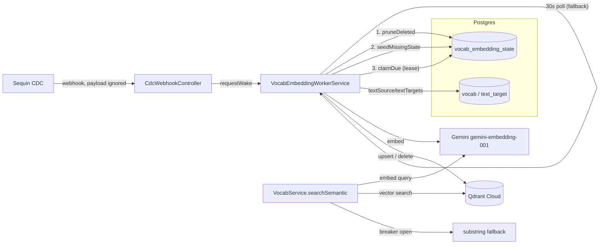

# Semantic Search (Vocab Embedding Sync)

## What it is

Cross-language semantic search over vocab: a query embedded with Gemini is matched against vector embeddings of every vocab's `textSource` + `textTargets`, stored in Qdrant Cloud. Keeping those vectors in sync with Postgres is a background worker, not a request-time write — creating or editing a vocab never blocks on an embedding call.

Terminology used below (orphan state/point, stale state/embedding, lease, candidate) is defined in [`CONTEXT.md`](../../CONTEXT.md).

## Why not embed on write

Embedding synchronously on create/update would tie API latency to Gemini's, and a Gemini outage would break vocab creation entirely. Instead, a background worker polls for **stale state** and catches up — see [`docs/adr/0001-cdc-webhook-ignores-payload.md`](../adr/0001-cdc-webhook-ignores-payload.md) for why even the low-latency CDC path (Sequin) only nudges that poll, never writes anything itself.

## Architecture

## The two-gate check

Deciding whether a vocab needs re-embedding is entirely SQL, computed at claim time (`vocab-embedding.repository.ts`):

1. **`sourceVersion`** (cheap gate) — `GREATEST(vocab.updated_at, MAX(text_target.updated_at)) || ':' || COUNT(text_target.id)`. Catches any edit, add, or delete on the source data. Mismatch → **stale state**.
2. **`contentHash`** (exact gate) — sha256 of the actual text sent to the embedding model. Only recomputed after a stale state is found. Mismatch → **stale embedding**, worth a Gemini call. Match → `markUnchanged`, no API call spent (e.g. editing `grammar` alone bumps `sourceVersion` but never touches the embedded text).

## Claim & lease

`claimDue` runs as two statements, not one `SELECT ... FOR UPDATE` (which Postgres rejects when combined with the `GROUP BY` the fingerprint needs):

1. An unlocked scan produces **candidates** — stale rows, provisionally available.
2. An `UPDATE ... WHERE locked_at IS NULL OR locked_at < now() - 5min` does the real arbitration. Under READ COMMITTED, a second worker blocked on the same row re-evaluates that `WHERE` once the lock frees and finds the lease already taken — only rows actually `RETURNING`ed are this worker's.

The **lease** (`locked_by`/`locked_at`) is ordinary data, not a Postgres row lock — it has to survive the slow embedding call, and a row lock ends at `COMMIT`. A crashed worker's lease simply expires after 5 minutes.

## Retry

A failed embed keeps `sourceVersion` unset so the row stays due, and backs off exponentially up to a 6h ceiling — it never gives up. See [`docs/adr/0002-embedding-retry-unbounded.md`](../adr/0002-embedding-retry-unbounded.md) for why there's no `maxAttempts` here, unlike `ReminderSchedule`.

## Cleanup

- **Orphan state** (vocab deleted, state row remains): found via anti-join in `findOrphans`, run every worker tick. Cheap — no Qdrant scan needed.
- **Orphan point** (Qdrant point remains, state row gone): only possible via manual DB surgery (e.g. `prisma migrate reset` outside this table's normal lifecycle). No automatic reconciler exists yet — `QdrantService.scrollVocabIds()` has the building block but nothing calls it.

## Degraded modes

- **Gemini or Qdrant breaker open** (`opossum`, separate breakers per service so one outage doesn't block the other): `searchSemantic` falls back to a Postgres **substring fallback**; the worker backs off and retries later.
- **Sequin down**: no correctness impact, only latency — the worker's own 30s poll is the fallback trigger.

## Point IDs

Qdrant rejects the app's `cuid` vocab IDs (requires uint64 or UUID), so each point ID is a UUID v5 derived from the vocab's cuid (`vocab-point-id.util.ts`) — deterministic and reproducible, but not reversible. The original `Vocab.id` travels in the point's payload for that reason.

## Locked parameters

Changing any of these requires re-embedding every row, so they're pinned as constants rather than config:

- Vector size: 768 (MRL truncation of `gemini-embedding-001`'s native 3072)
- Embedding text: `textSource` + `textTargets` only — no explanations or examples (`build-embedding-text.util.ts`)
- Distance metric: Cosine
