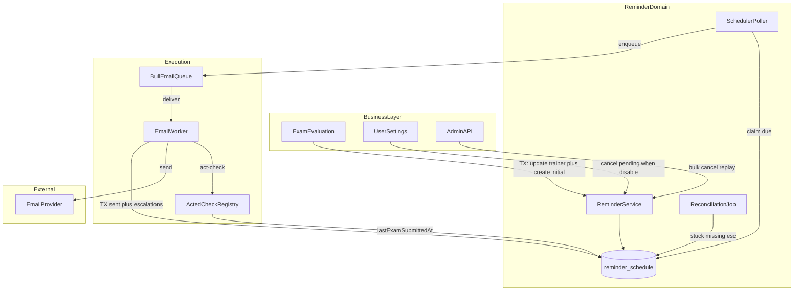
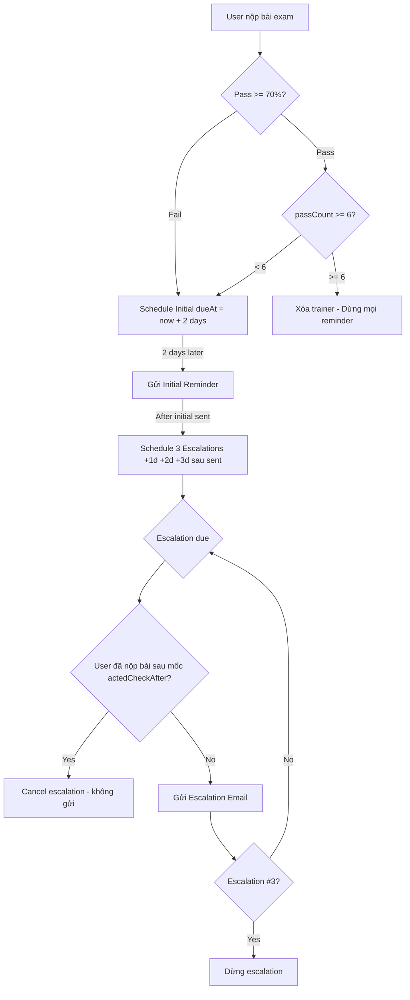
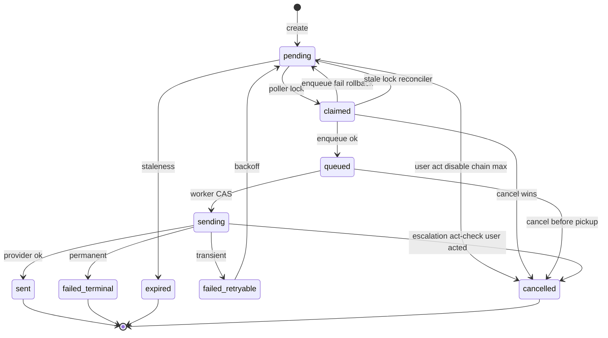
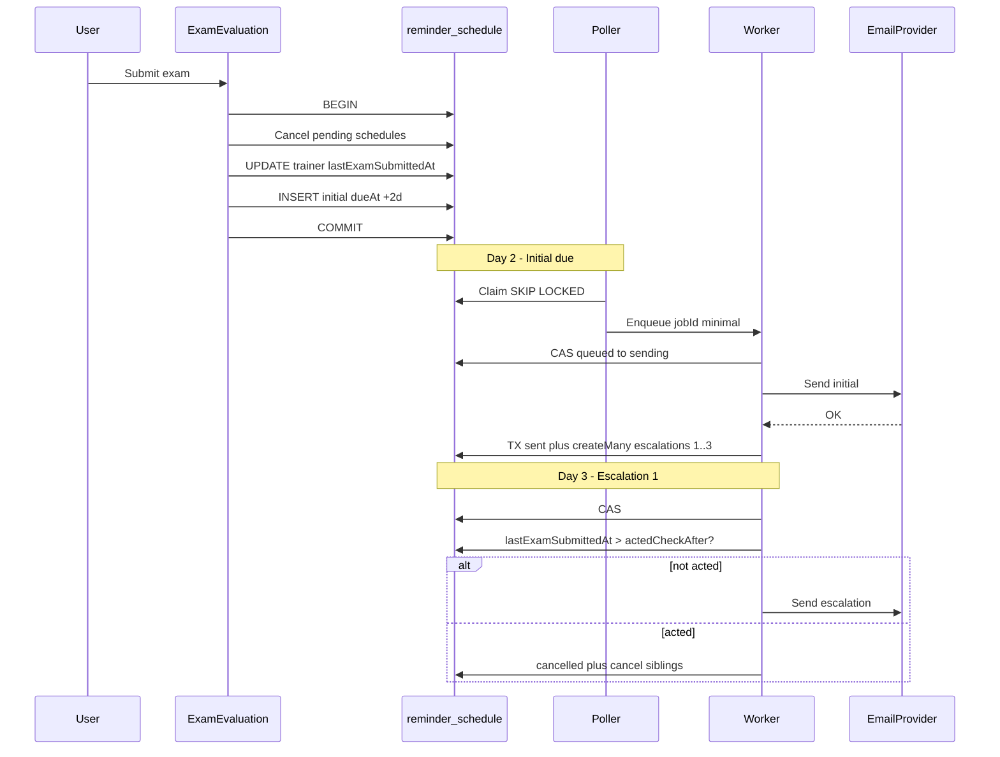
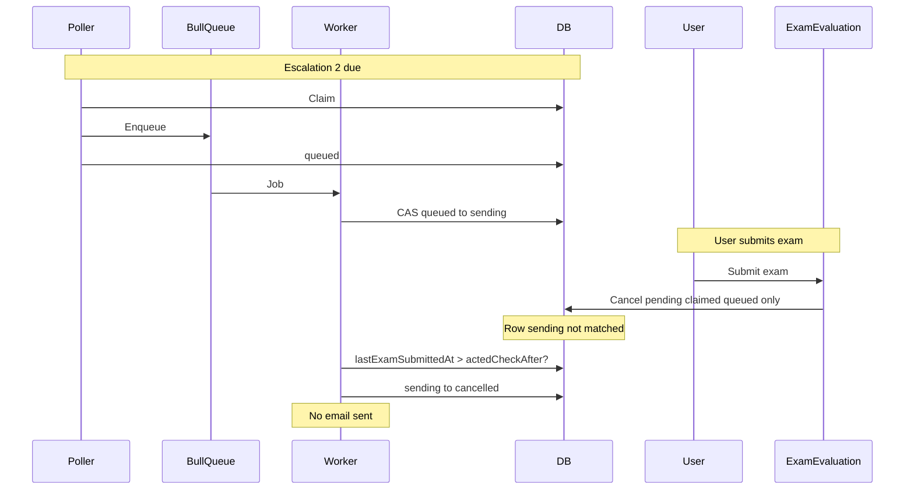

# Reminder mail & Escalation (thiết kế v3)

Tài liệu mô tả luồng **DB-first**: `reminder_schedule` là nguồn sự thật, **SchedulerPoller** claim đến hạn, **Bull** chỉ vận chuyển thực thi (`attempts: 1`, retry do DB), **EmailWorker** gửi mail và (với initial) tạo escalation trong **cùng transaction** với `sent`.

**Nguyên tắc v3**

| #   | Nguyên tắc                                                                                   |
| --- | -------------------------------------------------------------------------------------------- |
| 1   | **DB là source of truth** — mất queue thì poller enqueue lại từ DB.                          |
| 2   | **Gửi idempotent** — duplicate rate mục tiêu dưới 0.01%.                                     |
| 3   | **Defense in depth** — bulk cancel trong transaction exam + pre-send act-check + reconciler. |
| 4   | **Fail-safe** — crash ở bước nào cũng có đường phục hồi.                                     |
| 5   | **Explicit** — act-check dùng **`lastExamSubmittedAt`**, **không** dùng `updatedAt`.         |

**Trong scope v1:** initial (+2 ngày), escalation (tối đa 3), state machine, retry DB, pre-send act-check, chain limit (~30 cycle/trainer), reconciliation, cancel khi user act / disable / xóa trainer.

**Ngoài scope v1:** RRULE/cron; SMS/push (schema có thể mở); timezone-aware scheduling; webhook bounce.

Kế hoạch triển khai chi tiết (todos, dependency, rollout): xem plan repo `.cursor/plans/reminder-mail-workflow-plan_dfde5e9d.plan.md`.

---

## Mục lục

1. [Kiến trúc hệ thống](#1-kiến-trúc-hệ-thống)
2. [Phân tích yêu cầu & timeline](#2-phân-tích-yêu-cầu--timeline)
3. [Schema](#3-schema)
4. [State machine](#4-state-machine)
5. [Act-check & `lastExamSubmittedAt`](#5-act-check--lastexamsubmittedat)
6. [Escalation lifecycle](#6-escalation-lifecycle)
7. [Implementation](#7-implementation)
8. [Poller & collapse overdue](#8-poller--collapse-overdue)
9. [Reconciliation](#9-reconciliation)
10. [Rollout (từ queue trực tiếp → DB-first)](#10-rollout-từ-queue-trực-tiếp--db-first)
11. [Edge cases & race](#11-edge-cases--race)
12. [Config, SLO & metrics](#12-config-slo--metrics)
13. [Test checklist](#13-test-checklist)
14. [Ví dụ trạng thái DB](#14-ví-dụ-trạng-thái-db)
15. [Diagram: race bulk cancel vs `sending`](#15-diagram-race-bulk-cancel-vs-sending)

---

## 1. Kiến trúc hệ thống



**Luồng một cycle (tóm tắt)**

- **Day 0:** Transaction — cập nhật `vocab_trainer` (kết quả, **`lastExamSubmittedAt`**), insert `reminder_schedule` initial `dueAt = +2 ngày`.
- **Day 2:** Poller `SKIP LOCKED` → `claimed` → `Bull.add` → `queued`. Worker `queued` → `sending` (CAS), initial **không** act-check. Gửi OK → **một transaction** `sent` + `createMany` 3 escalation (`dueAt = sentAt + 1/2/3 ngày`, `actedCheckAfter = sentAt`).
- **Day 3+:** Escalation: CAS → act-check (`lastExamSubmittedAt > actedCheckAfter`) → hủy sibling hoặc gửi → `sent`.

---

## 2. Phân tích yêu cầu & timeline

- **Day 0:** User nộp bài exam
- **Day 2:** Gửi initial reminder
- **Day 3–5:** Tối đa 3 escalation (mỗi ngày một lần sau khi initial đã gửi), dừng sau esc #3 hoặc khi user pass đủ 6 lần / chain limit



---

## 3. Schema

### 3.1 `vocab_trainer`

```sql
ALTER TABLE vocab_trainer
  ADD COLUMN last_exam_submitted_at TIMESTAMPTZ NULL;
```

Chỉ cập nhật khi user **thực sự nộp bài** (không dùng `updatedAt` cho act-check — vì mọi UPDATE khác cũng bump `updatedAt`).

### 3.2 `reminder_schedule` (các nhóm field chính)

- **Identity:** `id`, `dedupe_key` (unique partial khi không cancelled/expired)
- **Delivery:** `channel` (v1: `CHECK (channel IN ('email'))`), `recipient`
- **Content:** `template`, `template_version`, `payload`, `subject`
- **Scheduling:** `due_at`, `priority`, `next_attempt_at` (retry DB)
- **State:** `status`, `attempt`, `max_attempts`
- **Lock poller:** `locked_by`, `locked_at`
- **Escalation:** `reminder_type` (`initial` | `escalation`), `escalation_level`, `escalation_max`, `initial_reminder_id`, `acted_check_after`
- **Chain:** `chain_count`, `chain_max`
- **Cancel / completion:** `cancelled_at`, `cancel_reason`, `sent_at`, `completed_at`
- **Business:** `user_id`, `entity_type`, `entity_id`, `metadata`

**Index (Postgres):**

- **Không** dùng `now()` trong predicate của **partial index** (không immutable). Điều kiện `due_at <= now()` chạy ở query.
- Index gợi ý: poller `(status, due_at)`, entity pending, escalation, user, stuck `claimed`.

### 3.3 Prisma (gợi ý)

```prisma
model ReminderSchedule {
  // ... identity, delivery, content, scheduling, state, lock, errors,
  // escalation, chain, cancel, sentAt, entity, userId, metadata ...

  reminderType      String    @default("initial") @map("reminder_type")
  escalationLevel   Int       @default(0) @map("escalation_level")
  escalationMax     Int       @default(3) @map("escalation_max")
  initialReminderId String?   @map("initial_reminder_id") @db.Uuid
  initialReminder   ReminderSchedule?  @relation("Escalation", fields: [initialReminderId], references: [id])
  escalations       ReminderSchedule[] @relation("Escalation")
  actedCheckAfter   DateTime? @map("acted_check_after") @db.Timestamptz
}
```

---

## 4. State machine

Trạng thái: `pending` → `claimed` → `queued` → `sending` → `sent` | `failed_retryable` | `failed_terminal` | `cancelled` | `expired`.

- **`sending` → `cancelled`:** chỉ escalation, khi act-check báo user đã **nộp bài sau** `actedCheckAfter`, **trước** khi gọi provider.
- **`failed_retryable` → `pending`:** sau backoff (retry do DB, không phụ thuộc Bull retry mạnh).



---

## 5. Act-check & `lastExamSubmittedAt`

### 5.1 Hai lớp bảo vệ

1. **Transaction nộp bài:** `updateMany` hủy `pending | claimed | queued` theo `entity_type` + `entity_id`. **Không** hủy `sending` (đang xử lý worker).
2. **Worker (escalation):** so sánh `trainer.lastExamSubmittedAt > actedCheckAfter` (mốc = `sentAt` của initial). Đúng → hủy escalation hiện tại + sibling pending, **không gửi mail**.

### 5.2 Tại sao không dùng `updatedAt`

`updatedAt` bị bump bởi migration, admin sửa, batch job — gây **false positive** (tưởng user đã act khi chưa).

### 5.3 Strategy pattern (mở rộng entity)

- `ActedCheckRegistry` + `VocabTrainerActedCheck`: đọc `lastExamSubmittedAt`.
- Trainer **đã xóa** → coi như đã “act” (không gửi escalation vô nghĩa).
- **TOCTOU:** giữa act-check và `provider.send` vẫn có cửa sổ nhỏ — chấp nhận hiếm khi một email thừa; không lock user.

---

## 6. Escalation lifecycle

### 6.1 Chiến lược: Pre-schedule + pre-send check

Sau khi **initial** chuyển `sent`, **một transaction** tạo đủ 3 row escalation (`createMany`, nên dùng `skipDuplicates` hoặc xử lý unique để reconciler idempotent). Mỗi row có `dueAt` lần lượt +1/+2/+3 ngày từ `sentAt`, cùng `actedCheckAfter = sentAt`.

### 6.2 Sequence (happy path) — chỉnh theo v3



---

## 7. Implementation

### 7.1 Exam flow (multiple-choice & fill-in-blank)

- **Cùng một luồng nghiệp vụ:** một **shared service** (ví dụ `VocabTrainerReminderAfterExam`) nhận `Prisma.TransactionClient`, cập nhật trainer + `lastExamSubmittedAt`, hủy schedule pending, tạo initial mới / xóa trainer nếu pass đủ 6.
- `vocab-trainer.service.ts` (MC) và `fill-in-blank-evaluation.processor.ts` **gọi service này**, không copy-paste hai logic.

### 7.2 Worker

- **Payload queue tối thiểu:** `{ scheduleId }` — luôn đọc lại DB (giảm PII trên Redis, tránh stale).
- Thứ tự: pre-flight `queued` → CAS `sending` → (escalation) act-check → render template (lỗi render → terminal) → send → **transaction** `sent` + `createEscalationsInTx` nếu initial.
- Bull: **`attempts: 1`** — retry do **DB** (`next_attempt_at`, `failed_retryable`).

### 7.3 Dedupe key

Chuẩn hóa qua util (ví dụ `buildReminderDedupeKey.initial(trainerId, chainCount)`, `.escalation(initialKey, level)`) — tránh hardcode string rải rác.

### 7.4 `createMany` escalation + unique `dedupe_key`

Dùng `skipDuplicates: true` (Prisma) hoặc `ON CONFLICT DO NOTHING` khi reconciler tạo lại sau crash giữa chừng.

---

## 8. Poller & collapse overdue

- Interval ~5s, batch ~50, `enqueueWithRollback`: Redis fail → rollback `claimed` → `pending`.
- **Graceful shutdown:** `OnModuleDestroy` — đợi vòng poll hiện tại xong để giảm `claimed` kẹt.
- **Collapse overdue:** sau downtime dài, có thể nhiều escalation pending cùng quá hạn — **expire** các bản cũ trong cùng chain, **giữ** bản có `escalation_level` cao nhất (chỉ khi `COUNT > 1`). **Verify SQL trên staging.**

```sql
UPDATE reminder_schedule
SET status = 'expired',
    completed_at = now(),
    cancel_reason = 'collapsed_overdue'
WHERE id IN (
  SELECT rs.id
  FROM reminder_schedule rs
  INNER JOIN (
    SELECT initial_reminder_id, MAX(escalation_level) AS max_level
    FROM reminder_schedule
    WHERE reminder_type = 'escalation'
      AND status = 'pending'
      AND due_at < now()
    GROUP BY initial_reminder_id
    HAVING COUNT(*) > 1
  ) keep
    ON rs.initial_reminder_id = keep.initial_reminder_id
  WHERE rs.reminder_type = 'escalation'
    AND rs.status = 'pending'
    AND rs.due_at < now()
    AND rs.escalation_level < keep.max_level
);
```

---

## 9. Reconciliation

Cron ~1 phút (ngưỡng trong `REMINDER_CONFIG`):

- Nhả lock `claimed` quá hạn
- `queued` nhưng không còn job Bull
- Initial `sent` thiếu escalation (chỉ tạo lại nếu user chưa act)
- Chuỗi gãy (trainer active nhưng không có pending hợp lệ)
- Gauge: pending, overdue, claimed, queue depth

---

## 10. Rollout (từ queue trực tiếp → DB-first)

Hiện trạng code: `ReminderService` enqueue Bull delayed trực tiếp. Mục tiêu: **API chỉ ghi DB**, poller đẩy queue.

| Phase | Mô tả                                                                                                                              |
| ----- | ---------------------------------------------------------------------------------------------------------------------------------- |
| **A** | Deploy migration + repository + worker mới; poller **tắt** hoặc không chạy interval.                                               |
| **B** | (Tùy chọn) Dual-write ngắn để so metric DB vs Bull — hoặc bỏ qua nếu big-bang sau drain.                                           |
| **C** | Drain / chờ hết delayed job cũ (hoặc script xóa map sang DB); bật poller; env `REMINDER_SOURCE=db`; API **không** enqueue path cũ. |
| **D** | Xóa code enqueue trực tiếp; gỡ flag; ghi rollback khẩn cấp (tắt poller) nếu cần.                                                   |

Trước khi bật poller: xử lý **in-flight Bull delayed** để tránh **double send** (old path + poller).

---

## 11. Edge cases & race

- **Bulk cancel vs `sending`:** bulk không chạm `sending` → act-check bắt bằng `lastExamSubmittedAt`.
- **Crash khi tạo escalation:** `createMany` một lần; reconciler bổ sung thiếu, idempotent.
- **Chain limit:** chỉ đếm `reminderType = initial` (terminal), không nhân 3 với escalation.
- **Template escalation:** khác initial / subject theo level (giảm spam perception).

---

## 12. Config, SLO & metrics

### `ESCALATION_CONFIG` (gợi ý)

```typescript
export const ESCALATION_CONFIG = {
  maxEscalations: 3,
  escalationIntervalDays: 1,
  enabledTemplates: ['vocab-review'],
  overrides: {
    'vocab-review': { maxEscalations: 3, escalationIntervalDays: 1 },
  },
};
```

### `REMINDER_CONFIG` (gợi ý)

Chain (`maxCycles`, `initialDelayDays`), poller (`intervalMs`, `batchSize`, `lockTimeoutMs`), retry (`maxAttempts`, backoff, jitter), staleness, reconciliation thresholds.

### SLO (mục tiêu)

| SLO                      | Target           |
| ------------------------ | ---------------- |
| Độ trễ gửi (sau đến hạn) | p95 dưới 30s     |
| Tỷ lệ gửi thành công     | từ 99.5% trở lên |
| Duplicate                | dưới 0.01%       |
| Phục hồi stuck           | dưới 5 phút      |

### Metrics (gợi ý)

`reminder_sent_total`, `reminder_failed_terminal_total`, `reminder_cancelled_total`, `reminder_escalation_skipped_total`, histogram latency, gauge `reminder_pending_count`, `reminder_queue_depth`.

---

## 13. Test checklist

- [ ] Initial `sent` → 3 escalation trong **cùng transaction**
- [ ] Escalation: `lastExamSubmittedAt > actedCheckAfter` → skip + cancel sibling
- [ ] **`updatedAt` đổi nhưng `lastExamSubmittedAt` không** → act-check vẫn **false** (test quan trọng)
- [ ] Race submit vs worker `sending` → act-check, không gửi
- [ ] MC và fill-in-blank cùng gọi **shared** reminder-after-exam service
- [ ] Reconciler: thiếu escalation sau crash — idempotent, không duplicate `dedupe_key`
- [ ] Rollout: không double send giữa Bull delayed cũ và poller mới
- [ ] `reminderDisabled` / xóa trainer → hủy pending
- [ ] Chain chỉ đếm initial

---

## 14. Ví dụ trạng thái DB

Sau khi initial đã gửi và tạo escalation:

```text
| id      | type       | lvl | status  | dueAt        | actedCheckAfter |
|---------|------------|-----|---------|--------------|-----------------|
| rem-001 | initial    |  0  | sent    | Jan 17 09:00 | NULL            |
| rem-002 | escalation |  1  | pending | Jan 18 09:00 | Jan 17 09:00    |
| rem-003 | escalation |  2  | pending | Jan 19 09:00 | Jan 17 09:00    |
| rem-004 | escalation |  3  | pending | Jan 20 09:00 | Jan 17 09:00    |
```

---

## 15. Diagram: race bulk cancel vs `sending`



---

## Module liên quan (repo)

| Vùng                           | File                                                                                                                           |
| ------------------------------ | ------------------------------------------------------------------------------------------------------------------------------ |
| Trainer / exam                 | `src/modules/vocab-trainer/service/vocab-trainer.service.ts`, `src/modules/ai/processor/fill-in-blank-evaluation.processor.ts` |
| Reminder API (tạm queue-first) | `src/modules/reminder/service/reminder.service.ts`, `src/modules/reminder/controller/reminder.controller.ts`                   |
| Email worker                   | `src/modules/email/processor/email.processor.ts`                                                                               |
| Mới (theo v3)                  | repository schedule, poller, reconciliation job, `ActedCheckRegistry`, dedupe util                                             |

## Q & A

## Reminder Schedule

**một `vocab_trainer` có thể có nhiều `reminder_schedule`** (theo thời gian), nhưng không “vô hạn” vì có `chainMax`.

## Khi submit tạo initial mới, initial cũ đang status gì?

Tùy thời điểm user submit so với lịch nhắc:

### Trường hợp 1: submit **trước khi** initial cũ kịp gửi

Initial cũ thường đang ở một trong các status “active chưa gửi”:

- `PENDING` (đến hạn chưa)
- `CLAIMED` (poller vừa claim)
- `QUEUED` (đã enqueue Bull)

Khi submit, code sẽ **cancel** các status active này → initial cũ thành:

- **`CANCELLED`** (kèm `cancelReason = 'exam_submitted'`, `completedAt`, …)

### Trường hợp 2: submit **sau khi** initial cũ đã gửi

Initial cũ đã ở:

- **`SENT`** (và đã có thể tạo escalation 1/2/3)

Khi submit mới, code chỉ cancel các active pending/claimed/queued (các escalation pending nếu còn) → chúng thành `CANCELLED`.  
Còn initial `SENT` **giữ nguyên** (là lịch sử).

### Trường hợp 3: initial cũ bị lỗi/hết hạn

Initial cũ có thể ở:

- `FAILED_TERMINAL` (fail vĩnh viễn)
- `EXPIRED` (theo policy/reconciler)

Các cái này cũng **không bị “cancel lại”**; nó là lịch sử.

## Vậy 1 vocab trainer sẽ có rất nhiều reminder_schedule?

**Có thể có nhiều**, cấu trúc thường là:

- Mỗi “cycle” (mỗi lần tạo initial) có **1 row INITIAL**
- Nếu INITIAL `SENT` thì có thêm **tối đa 3 row ESCALATION** (level 1/2/3)

Nên theo thời gian, trainer có thể có:  
`(INITIAL #1 + escalations)`, rồi `INITIAL #2 + escalations`, … cho tới khi:

- trainer bị xóa vì pass đủ 6 lần, hoặc
- chạm `chainMax` (ngừng tạo initial mới)

Điểm quan trọng: **một row `reminder_schedule` là một lần nhắc cụ thể**, không phải “một state duy nhất cho trainer”.

## RECONCILER

**Reconciler** (trong repo bạn là `ReminderReconciliationService`) là một “**thợ sửa sổ**” chạy định kỳ, chuyên **dọn dẹp và tự sửa các trạng thái lệch** giữa **DB (source of truth)** và **queue/worker** khi hệ thống gặp crash, deploy, Redis lỗi, hoặc race.

Nếu ví hệ thống là giao hàng:

- **DB `reminder_schedule`** = “**sổ đơn hàng chuẩn**”
- **Bull/Redis job** = “**phiếu chuyển cho shipper**”
- **Worker** = “shipper đi giao”
- **Reconciler** = “**đội kiểm soát**”: thấy đơn nào kẹt, mất phiếu, thiếu bước… thì **đẩy lại vào luồng đúng**.

## Reconciler làm gì trong thiết kế này?

Trong code hiện tại (v3), nó làm các việc chính:

1. **Thả các dòng `CLAIMED` bị kẹt (stale lock)**  
   Nếu poller claim (`PENDING → CLAIMED`) rồi pod chết trước khi enqueue job → dòng sẽ kẹt ở `CLAIMED`.  
   Reconciler thấy `lockedAt` quá lâu → reset về **`PENDING`** để poller claim lại.

2. **Sửa `QUEUED` bị “mồ côi” (orphaned queued)**  
   DB nói “đã `QUEUED`”, nhưng trong Bull lại **không có job** (Redis mất job / remove / restart).  
   Reconciler check `getJob(jobId)` không thấy → reset về **`PENDING`** để enqueue lại.

3. **Backfill escalation bị thiếu**  
   Initial đã `SENT` nhưng vì crash giữa chừng nên chưa tạo đủ escalation 1/2/3.  
   Reconciler phát hiện thiếu children → tạo lại bằng `createMany(skipDuplicates)` để **không tạo trùng**.

4. **Collapse overdue escalations (dọn trùng pending quá hạn)**  
   Nếu vì lỗi nào đó có nhiều escalation pending quá hạn cho cùng initial, reconciler expire bớt (giữ cái level cao nhất).

## Vì sao cần Reconciler?

Vì dù bạn có poller + worker chuẩn, trong hệ thống distributed luôn có tình huống “giữa đường rơi hàng”:

- Pod chết đúng lúc đang chuyển trạng thái
- Redis mất job
- Crash giữa lúc tạo batch escalation
- Race khiến status/queue lệch nhau

**Reconciler là lớp “tự hồi phục”** để hệ thống đạt mục tiêu plan: **DB là source of truth**, queue mất thì **tự phục hồi**, không cần can thiệp tay.

Nếu bạn muốn, mình có thể mô tả 1 flow “pod chết ở bước nào thì reconciler sửa thế nào” bằng timeline T0–T5 cho từng case.

## DEDUPKEY

`dedupe_key` dùng để **chống tạo trùng “cùng một intent gửi”** trong các case bạn đang nói (một trainer có nhiều `reminder_schedule` theo thời gian).

## `dedupe_key` bảo vệ cái gì?

Nó đảm bảo: **tại cùng một thời điểm, chỉ có 1 record “active”** cho cùng một intent gửi (initial cycle X, hoặc escalation level Y của initial đó).

DB enforce bằng **partial unique index**:

```82:85:prisma/migrations/20260329133000_reminder_schedule_v3/migration.sql
CREATE UNIQUE INDEX "reminder_schedule_dedupe_key_active_idx" ON "reminder_schedule" ("dedupe_key")
WHERE "status" NOT IN ('CANCELLED', 'EXPIRED');
```

## “Intent” được định nghĩa như thế nào?

Dedupe key được chuẩn hóa theo util:

```1:9:src/modules/reminder/util/reminder-dedupe-key.util.ts
export const buildReminderDedupeKey = {
    vocabTrainerInitial(trainerId: string, chainIndex: number): string {
        return `vocab-trainer:${trainerId}:initial:chain-${chainIndex}`;
    },

    vocabTrainerEscalation(initialDedupeKey: string, level: number): string {
        return `${initialDedupeKey}:esc-${level}`;
    },
};
```

- **Initial**: phụ thuộc `trainerId` + “cycle index”
- **Escalation**: phụ thuộc “initial dedupe key” + `level`

## Nó giải quyết các case nào trong thực tế?

- **User submit gần nhau / race tạo initial**: 2 request cùng tính “cycle kế tiếp” → cả hai cố insert initial cùng `dedupe_key` → DB chặn trùng (1 thắng, 1 fail P2002) ⇒ không tạo 2 initial cho cùng cycle.
- **Crash giữa chừng khi tạo escalation**: initial đã `SENT` nhưng app chết giữa việc tạo 3 escalation → reconciler/backfill tạo lại `createMany` ⇒ nhờ `dedupe_key` + `skipDuplicates`, không tạo escalation trùng.
- **Poller/queue không phải nguồn chân lý**: Bull job có thể trùng/queue mất job; poller re-enqueue dựa DB. `dedupe_key` đảm bảo **DB record** không bị nhân đôi bởi replay logic ở tầng app.

## Tại sao index “cho phép” trùng khi `CANCELLED` / `EXPIRED`?

Vì 2 trạng thái này được coi là **không còn active intent**:

- `CANCELLED`: intent bị hủy (user submit mới / acted / disable…)
- `EXPIRED`: intent hết hạn (policy/collapse)

→ Khi đã cancelled/expired, cho phép **tạo lại intent tương tự** nếu business muốn (ít nhất là không bị unique block).

Tóm lại: so với các case “1 trainer có nhiều schedule”, `dedupe_key` là **khóa nghiệp vụ** để mỗi “slot gửi” chỉ có **1 bản ghi active**, giúp hệ thống idempotent khi có race/crash/reconcile.

## TERMINAL

“**Terminal**” trong state machine nghĩa là **trạng thái kết thúc (end state)**: khi một record đã vào đó thì **không còn bước xử lý tiếp theo** trong workflow bình thường nữa (không được poller claim, không gửi lại, không chuyển sang trạng thái khác trừ khi có “admin reset/replay” đặc biệt).

Trong thiết kế reminder này, các trạng thái kiểu terminal thường là:

- **`SENT`**: đã gửi xong → kết thúc lifecycle của record.
- **`FAILED_TERMINAL`**: thất bại vĩnh viễn → kết thúc (không retry nữa).
- **`EXPIRED`**: hết hạn/chính sách không gửi nữa → kết thúc.
- **`CANCELLED`**: bị hủy do nghiệp vụ → kết thúc.

Từ “terminal” dùng để phân biệt với các trạng thái **non-terminal** như `PENDING / CLAIMED / QUEUED / SENDING` (vẫn còn “đang xử lý / sẽ xử lý tiếp”).

## TERMINAL INITIAL COUNT

`terminalInitialCount` là **COUNT trong DB**, nên nó ra **0, 1, 2, 3…** (số nguyên tăng dần theo lịch sử). Vì vậy:

- Nếu chưa có initial nào “terminal” ⇒ `terminalInitialCount = 0` ⇒ `chainIndex = 1`
- Sau khi initial #1 đã `SENT` (hoặc `FAILED_TERMINAL`/`EXPIRED`) ⇒ lần sau đếm được `1` ⇒ `chainIndex = 2`
- Sau khi có 2 initial terminal ⇒ đếm `2` ⇒ `chainIndex = 3`
- …

Nó chỉ “trông giống ngẫu nhiên” nếu bạn nghĩ `terminalInitialCount` không ổn định, nhưng thực tế nó là **đếm record** theo điều kiện cố định (entityId + reminderType + status nhóm terminal).  
Race condition có thể làm **hai request cùng lúc** cùng thấy `terminalInitialCount = 0` (đều ra `chainIndex = 1`), nhưng đó là chủ đích để **dedupe_key trùng** và DB **chặn một cái**.
